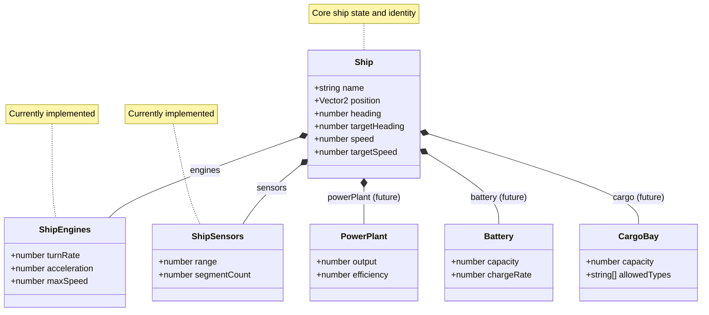

# ADR-0008: Ship Composition Architecture

## Status

Accepted

## Context

The player's ship in the Space Freighter Simulator needs to support modular subsystems that can be upgraded, damaged, or replaced. Previously, ship properties like `maxSpeed`, `turnRate`, and `acceleration` were defined as flat properties on the `Ship` interface. This made it difficult to:

1. Group related properties by subsystem (engines, sensors, etc.)
2. Support future upgrade mechanics where subsystems could be swapped
3. Apply system status effects (damaged engines = reduced performance)
4. Extend with new subsystems without bloating the base interface

The game will eventually feature multiple subsystems:
- **Engines**: Control `turnRate`, `acceleration`, and `maxSpeed`
- **Sensors**: Control `range` and `segmentCount` (fidelity)
- **Power Plant**: Will provide power generation (future)
- **Battery**: Will store power for burst operations (future)
- **Cargo Bay**: Will define cargo capacity and types (future)

## Decision

Refactor the `Ship` interface to use a composition pattern where the ship contains subsystem objects. Each subsystem is its own interface with relevant properties:

```typescript
export interface ShipEngines {
  turnRate: number;      // degrees per second
  acceleration: number;  // units per second squared
  maxSpeed: number;      // maximum forward speed
}

export interface ShipSensors {
  range: number;              // maximum detection range
  segmentCount: number;       // radar fidelity (number of angular segments)
}

export interface Ship {
  name: string;
  position: Vector2;
  heading: number;
  targetHeading: number;
  speed: number;
  targetSpeed: number;
  engines: ShipEngines;
  sensors: ShipSensors;
}
```

### Architecture Diagram



This approach allows:
- Subsystems to be independently upgraded or replaced
- Clear separation of concerns for ship capabilities
- Easy addition of new subsystems without modifying existing code
- Future support for subsystem damage affecting specific capabilities

## Consequences

### Positive

- Ship capabilities are logically grouped by subsystem
- Upgrades can modify entire subsystem objects
- New subsystems can be added without changing existing interfaces
- Sensor fidelity becomes a ship property, enabling future upgrade mechanics
- Clear path for implementing ship equipment and upgrade systems
- UI-specific settings (like proximity display scale) kept separate in settingsStore

### Negative

- Breaking change requires updating all code that accesses ship properties
- Slightly more verbose property access (`ship.engines.maxSpeed` vs `ship.maxSpeed`)
- Tests need updating to use new structure
- Initial implementation only includes engines and sensors; other subsystems are placeholders

### Migration

The `shipStore` and `MovementSystem` are updated to access properties through subsystem objects. The `sensorStore` reads sensor configuration from the ship's `sensors` subsystem.

## Alternatives Considered

### Flat Properties with Prefixes
Keep flat properties like `engineTurnRate`, `sensorRange`. Rejected because it doesn't provide grouping or support swapping entire subsystems.

### Separate Subsystem Stores
Create separate Pinia stores for each subsystem. Rejected as overly complex; the ship should own its subsystems, not reference external state.

### Component-Entity-System (ECS)
Use a full ECS architecture with components. Rejected as overkill for the current scope; can be reconsidered if complexity grows significantly.

## References

- [Ship.ts](../../src/models/Ship.ts) - Ship and subsystem interfaces
- [shipStore.ts](../../src/stores/shipStore.ts) - Ship state management
- [ADR-0009: Proximity Tracing](./0009-proximity-tracing.md) - Uses ship sensor configuration
