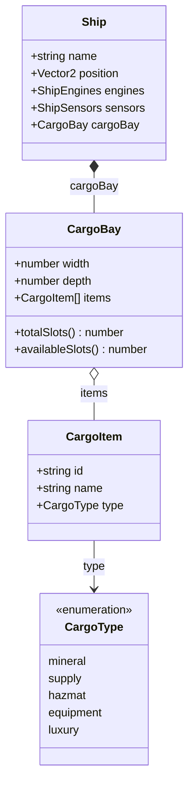

# Data Model: Cargo Screen Feature

**Feature Branch**: `SKY-4-CargoScreen`  
**Date**: January 22, 2026  
**Phase**: 1 - Design & Contracts

## Entity Definitions

### CargoItem

Represents a single unit of cargo occupying exactly 1 slot in the cargo bay.

```typescript
/**
 * Cargo type categories for classification and visual styling
 */
export type CargoType = 'mineral' | 'supply' | 'hazmat' | 'equipment' | 'luxury';

/**
 * A single cargo item occupying one slot in the cargo bay
 */
export interface CargoItem {
  /** Unique identifier for this cargo instance */
  id: string;
  
  /** Display name of the cargo (e.g., "Dilithium Crystals") */
  name: string;
  
  /** Category classification for filtering and display */
  type: CargoType;
}
```

**Validation Rules**:
- `id`: Required, must be unique within cargo bay
- `name`: Required, non-empty string
- `type`: Required, must be valid CargoType

**Notes**:
- Each CargoItem occupies exactly 1 slot (per clarification)
- Multiple units of same cargo type are stored as separate CargoItem instances
- No weight/volume attributes in v1

---

### CargoBay

Ship subsystem representing the cargo storage system. Follows ADR-0008 composition pattern.

```typescript
/**
 * Cargo bay ship subsystem - defines capacity and contains cargo items
 * Follows ship composition pattern from ADR-0008
 */
export interface CargoBay {
  /** Number of slots across the bay (columns) */
  width: number;
  
  /** Number of slots deep in the bay (rows) */
  depth: number;
  
  /** Collection of cargo items currently loaded */
  items: CargoItem[];
}

/**
 * Default cargo bay configuration for new ships
 */
export const DEFAULT_CARGO_BAY: CargoBay = {
  width: 4,
  depth: 6,
  items: [],
};
```

**Derived Properties** (computed in store):
- `totalSlots`: `width × depth` - Maximum storage capacity
- `occupiedSlots`: `items.length` - Slots currently in use  
- `availableSlots`: `totalSlots - occupiedSlots` - Remaining capacity
- `isFull`: `occupiedSlots >= totalSlots`
- `isEmpty`: `items.length === 0`
- `capacityPercent`: `(occupiedSlots / totalSlots) * 100`

**Validation Rules**:
- `width`: Required, positive integer, minimum 1
- `depth`: Required, positive integer, minimum 1
- `items.length`: Must not exceed `width × depth`

---

### Ship (Modified)

Update to Ship interface adding cargo bay subsystem per ADR-0008.

```typescript
import type { CargoBay } from './CargoBay';

/**
 * Player ship state - updated to include cargo bay subsystem
 */
export interface Ship {
  name: string;
  position: Vector2;
  heading: number;
  targetHeading: number;
  speed: number;
  targetSpeed: number;
  engines: ShipEngines;
  sensors: ShipSensors;
  cargoBay: CargoBay;  // NEW: Cargo subsystem
}

/**
 * Updated default ship configuration
 */
export const DEFAULT_SHIP: Ship = {
  name: 'Freighter',
  position: { x: 0, y: 0 },
  heading: 0,
  targetHeading: 0,
  speed: 0,
  targetSpeed: 0,
  engines: { ...DEFAULT_ENGINES },
  sensors: { ...DEFAULT_SENSORS },
  cargoBay: { ...DEFAULT_CARGO_BAY },  // NEW
};
```

---

## Entity Relationships



---

## State Management

### cargoStore

Pinia store managing cargo operations. References ship's cargoBay for capacity limits.

**State**:
- None directly (cargo items stored in shipStore.cargoBay.items)

**Getters** (computed from shipStore):
- `items: CargoItem[]` - Current cargo items
- `totalSlots: number` - Maximum capacity
- `occupiedSlots: number` - Used slots
- `availableSlots: number` - Remaining slots
- `isFull: boolean` - At capacity check
- `isEmpty: boolean` - No cargo check
- `capacityPercent: number` - Usage percentage
- `itemsByType: Map<CargoType, CargoItem[]>` - Items grouped by type

**Actions**:
- `loadCargo(item: CargoItem): boolean` - Add item if space available
- `unloadCargo(itemId: string): CargoItem | null` - Remove and return item
- `clearCargo(): void` - Remove all cargo
- `getItemsOfType(type: CargoType): CargoItem[]` - Filter by type

---

## Grid Layout Specification

The cargo grid renders cargo bay visually as a 2D grid of slots.

```
┌─────────────────────────────────────┐
│  [0,0]  [1,0]  [2,0]  [3,0]        │  ← Row 0 (depth index)
│  [0,1]  [1,1]  [2,1]  [3,1]        │  ← Row 1
│  [0,2]  [1,2]  [2,2]  [3,2]        │  ← Row 2
│  [0,3]  [1,3]  [2,3]  [3,3]        │  ← Row 3
│  [0,4]  [1,4]  [2,4]  [3,4]        │  ← Row 4
│  [0,5]  [1,5]  [2,5]  [3,5]        │  ← Row 5
└─────────────────────────────────────┘
   ↑      ↑      ↑      ↑
  Col 0  Col 1  Col 2  Col 3 (width index)

Example: 4 width × 6 depth = 24 total slots
```

**Slot Positioning**:
- Slot index `i` maps to grid position: `col = i % width`, `row = floor(i / width)`
- Items fill sequentially from top-left (0,0) to bottom-right

**Visual Representation**:
- Empty slot: Dark rectangle with subtle border
- Occupied slot: Colored rectangle based on CargoType
- Selected slot (future): Highlighted border

**Color Mapping by Type**:
| CargoType | Color | SCSS Variable |
|-----------|-------|---------------|
| mineral | Gold | `$color-gold` |
| supply | White | `$color-white` |
| hazmat | Danger Red | `$color-danger` |
| equipment | Purple | `$color-purple` |
| luxury | Success Green | `$color-success` |

---

## Validation Summary

| Entity | Field | Validation |
|--------|-------|------------|
| CargoItem | id | Required, unique |
| CargoItem | name | Required, non-empty |
| CargoItem | type | Required, valid CargoType |
| CargoBay | width | Required, ≥ 1 |
| CargoBay | depth | Required, ≥ 1 |
| CargoBay | items | Length ≤ width × depth |
